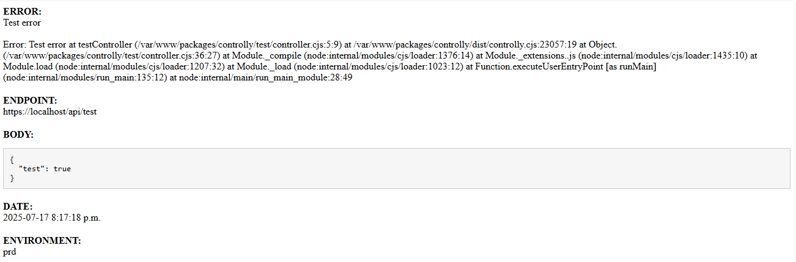

# controlly

Controlly is a simple Express.js middleware that wraps your controller functions with error handling and sends error notification emails...



## ✨ Features
✅ Automatically rolls back open transactions on error
✅ Logs error messages and stack traces
✅ Sends error notification emails in production environments
✅ Customizable environments for email notifications

## 🚀 Installation

```bash
npm install controlly
```

## 📦 Usage example

```javascript
import express from 'express';
import { controller } from 'controlly';
import { moviesController } from './controllers/movies.controller.js';

const app = express();

app.get('/api/users', controller(async (req, res) => {
    // Your controller logic here
    res.json({ users: [] });
}));

app.get('/api/movies', controller(moviesController));
```

## Environment variables

1. You must set the following environment variables in your `.env` file:

| Variable                      | Description                                                                                               |
| ----------------------------- | --------------------------------------------------------------------------------------------------------- |
| `APP_ENVIRONMENT`             | The environment name where your app is running (e.g., development, production). Error emails are sent only if this matches allowed environments |
| `MAIL_HOST`                   | The SMTP server hostname used to send emails (e.g., smtp.gmail.com). |
| `MAIL_PORT`                   | The SMTP server port (commonly 587 for TLS or 465 for SSL). |
| `MAIL_PASSWORD`               | The password or SMTP token to authenticate with the mail server. |
| `MAIL_SECURE`                 | (Optional) Set to true if the SMTP server requires TLS or SSL. Defaults to false. |
| `MAIL_FROM`                   | The sender email address that will appear in error notification emails. |
| `MAIL_TO`                     | The recipient email address where error notifications will be sent. |
| `MAIL_EXCEPTION_ENVIRONMENTS` | (Optional) Comma-separated list of environments where error emails should be sent. Defaults to prod,prd,production if not defined. |